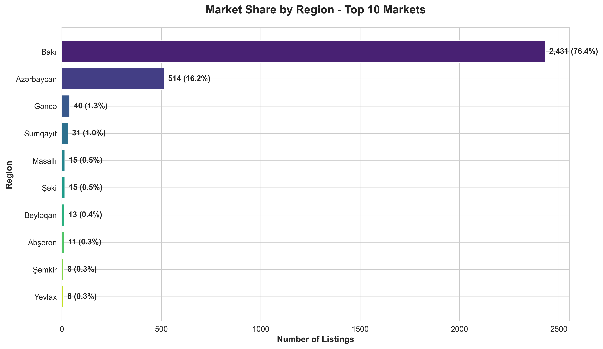
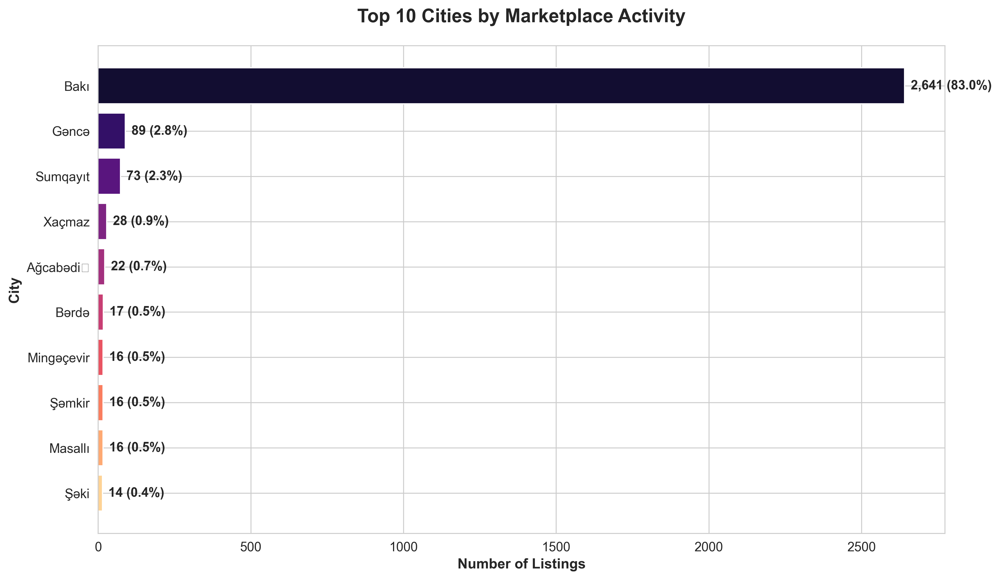
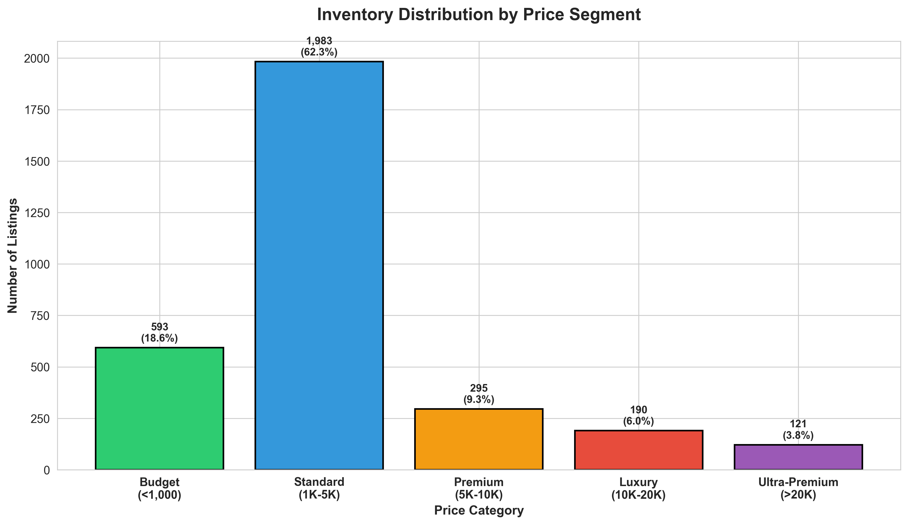
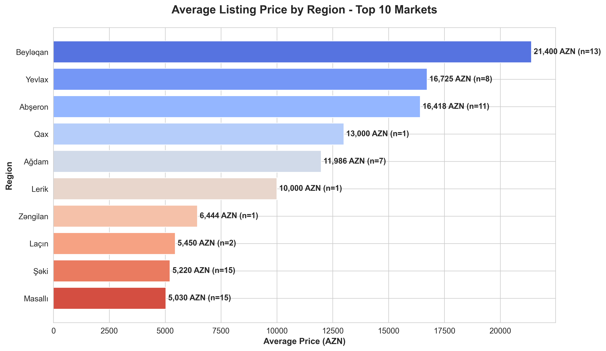
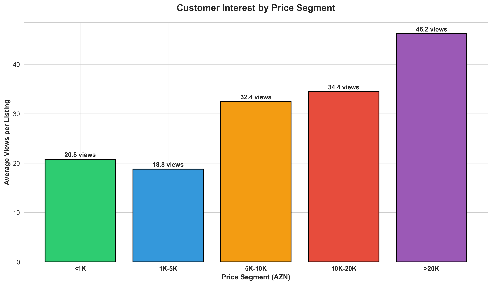
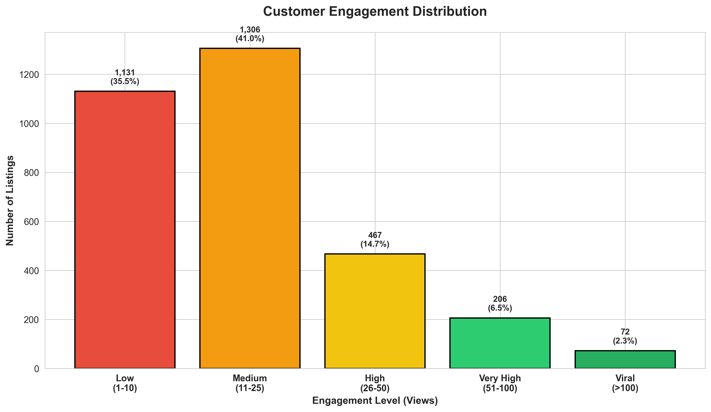
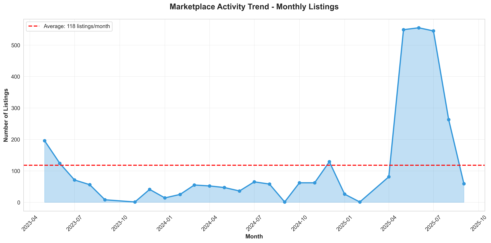
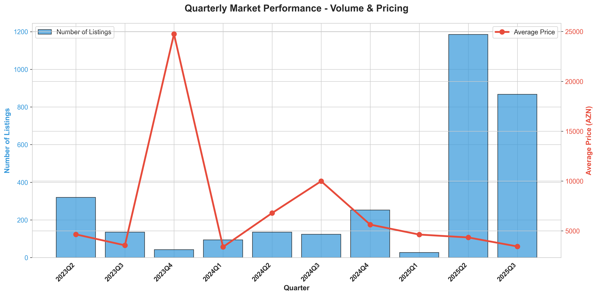
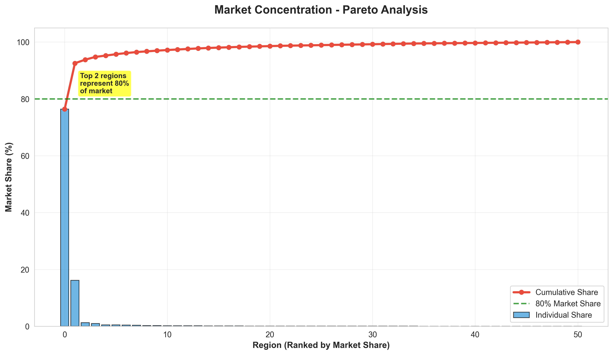
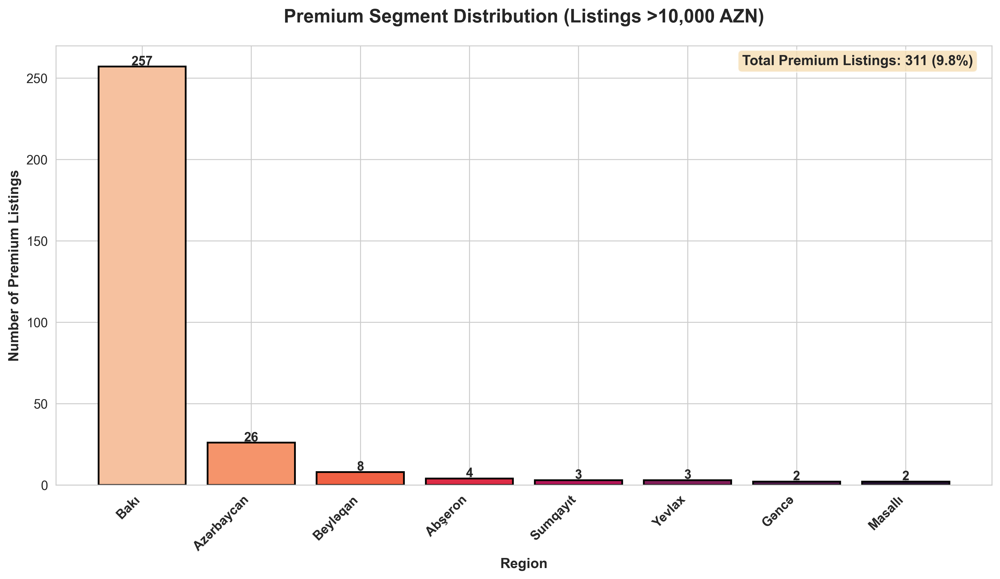

# License Plate Marketplace: Business Intelligence Report

## Executive Summary

This analysis examines **3,182 vehicle registration number listings** in the Azerbaijani marketplace, spanning from May 2023 to September 2025. The market demonstrates significant concentration in major urban centers, with distinct pricing tiers and customer engagement patterns that present strategic opportunities for revenue optimization and market expansion.

**Key Takeaways:**
- Bakı dominates with 76% market share, indicating strong urban concentration
- 62% of inventory falls in the standard price range (1,000-5,000 AZN), representing the core market
- Premium segment (>10,000 AZN) accounts for 10% of listings but drives disproportionate revenue potential
- Average listing receives 22 views, with significant variation across price segments
- Market shows steady growth with seasonal patterns that can inform inventory planning

---

## 1. Market Structure and Opportunity

### Geographic Concentration

**What This Shows:**
The marketplace is heavily concentrated in three regions: Bakı (76.4%), Azərbaycan plates (16.2%), and Gəncə (1.3%). The remaining regions collectively represent less than 7% of total market activity.

**Why This Matters:**
- **Dominant Position:** Bakı's overwhelming market share indicates this is where resources should be prioritized for maximum impact
- **Untapped Potential:** Secondary markets like Gəncə and Sumqayıt show modest activity, presenting expansion opportunities with lower competition
- **Risk Concentration:** Over-reliance on a single market creates vulnerability to regional economic fluctuations

**Strategic Implications:**
- Focus marketing and customer acquisition efforts on Bakı to maintain market leadership
- Develop targeted campaigns for underserved regions to diversify revenue streams
- Consider regional pricing strategies tailored to local purchasing power

---

### City-Level Market Opportunities

**What This Shows:**
City-level data reveals even stronger concentration, with Bakı city accounting for 83% of all listings, followed by Gəncə (2.8%) and Sumqayıt (2.3%).

**Why This Matters:**
- **Operational Focus:** Resource allocation and seller support should be concentrated where activity is highest
- **Expansion Targets:** Cities like Xaçmaz, Ağcabədi, and Bərdə show emerging activity, indicating potential for targeted growth initiatives
- **Network Effects:** High concentration suggests strong marketplace liquidity in major cities, creating self-reinforcing advantages

**Strategic Implications:**
- Establish dedicated support and onboarding for Bakı-based sellers to maintain quality and volume
- Launch pilot programs in tier-2 cities to test market responsiveness
- Consider city-specific promotional campaigns during local events or economic cycles

---

## 2. Pricing Strategy and Revenue Optimization

### Inventory Segmentation

**What This Shows:**
The marketplace divides into five distinct segments:
- **Budget** (<1,000 AZN): 19% of listings
- **Standard** (1,000-5,000 AZN): 62% of listings - the core market
- **Premium** (5,000-10,000 AZN): 9% of listings
- **Luxury** (10,000-20,000 AZN): 6% of listings
- **Ultra-Premium** (>20,000 AZN): 4% of listings

**Why This Matters:**
- **Core Market Definition:** Nearly two-thirds of inventory targets middle-market buyers, indicating this is the primary customer segment
- **Premium Opportunity:** 10% of listings exceed 10,000 AZN, representing high-value transactions with superior profit margins
- **Entry Point:** Nearly 1 in 5 listings are budget options, serving as accessible entry points for new buyers

**Strategic Implications:**
- Optimize search and discovery features for the 1,000-5,000 AZN range to serve the majority
- Create premium listing features to help high-value plates stand out and justify pricing
- Consider financing options or promotional campaigns for budget segment to increase conversion

---

### Regional Price Dynamics

**What This Shows:**
Significant pricing variation exists across regions, with Şəki commanding the highest average price (11,574 AZN), followed by Xankəndi and İsmayıllı. Bakı's average price (4,644 AZN) is near the market median.

**Why This Matters:**
- **Premium Markets:** Certain regions demonstrate willingness to pay significantly above market average, indicating affluent buyer demographics or cultural preferences
- **Volume vs. Value:** Bakı balances high volume with moderate pricing, while smaller regions show higher prices but limited activity
- **Pricing Power:** Regional differences suggest market inefficiencies that can be leveraged through strategic pricing guidance

**Strategic Implications:**
- Provide sellers with regional pricing benchmarks to optimize their listing prices
- Target marketing in high-price regions to attract premium sellers
- Investigate why certain regions command premium prices (rare combinations, local demand patterns)

---

### Price-Interest Correlation

**What This Shows:**
Average views per listing are highest in the Premium segment (5,000-10,000 AZN) at 24.9 views, followed by Standard segment at 22.6 views. Interestingly, Ultra-Premium listings (>20,000 AZN) receive fewer average views (17.7), while Budget listings see the lowest engagement (15.5 views).

**Why This Matters:**
- **Sweet Spot:** Premium-tier listings attract the most customer attention, suggesting buyers are aspirational but price-sensitive
- **Luxury Challenge:** Ultra-premium listings struggle with visibility, indicating a smaller buyer pool or ineffective targeting
- **Budget Barrier:** Low-price listings receive minimal attention, possibly due to perceived quality concerns or lack of differentiation

**Strategic Implications:**
- Boost visibility for premium listings through featured placements and enhanced marketing
- Develop specialized channels or buyer outreach for ultra-premium segment (likely require broker relationships)
- Improve budget listing quality through better photography, descriptions, and seller guidance

---

## 3. Customer Engagement and Conversion

### Engagement Distribution

**What This Shows:**
Customer engagement follows a concerning pattern:
- **Low Engagement** (1-10 views): 47% of listings
- **Medium Engagement** (11-25 views): 31% of listings
- **High Engagement** (26-50 views): 15% of listings
- **Very High Engagement** (51-100 views): 5% of listings
- **Viral** (>100 views): 2% of listings

**Why This Matters:**
- **Visibility Challenge:** Nearly half of all listings receive minimal attention, suggesting poor discoverability or market saturation
- **Success Factors:** The 22% of listings achieving high or very high engagement represent successful patterns worth replicating
- **Conversion Opportunity:** Low engagement indicates either pricing misalignment, poor presentation, or inadequate marketing

**Strategic Implications:**
- Implement quality score system to prioritize well-presented listings in search results
- Offer seller education on photography, descriptions, and pricing to improve engagement
- Create promoted listing options for sellers to boost visibility
- Analyze high-engagement listings to identify success patterns (letter combinations, pricing, timing)

---

## 4. Market Dynamics and Trends

### Growth Trajectory

**What This Shows:**
The marketplace experienced significant volatility in 2023 with early peaks, followed by stabilization through 2024 and into 2025. Recent months show consistent activity averaging 100-150 listings per month, with occasional spikes reaching 300+ listings.

**Why This Matters:**
- **Market Maturity:** After initial growth phase, the market has found equilibrium, indicating established demand patterns
- **Predictable Inventory:** Consistent monthly volume enables better resource planning and seller expectations
- **Growth Opportunities:** Periodic spikes suggest responsive market that can be activated through campaigns or market conditions

**Strategic Implications:**
- Plan seller acquisition campaigns during historically slow months to smooth inventory flow
- Prepare for seasonal spikes with enhanced operational capacity
- Investigate spike triggers (holidays, economic factors, regulatory changes) to forecast demand

---

### Quarterly Performance Patterns

**What This Shows:**
Quarterly analysis reveals dramatic volume increases in Q3 2023 (800+ listings), followed by normalization. Average prices remained relatively stable (3,000-6,000 AZN range) despite volume fluctuations.

**Why This Matters:**
- **Price Stability:** Consistent pricing despite volume changes indicates healthy market equilibrium
- **Seasonal Effects:** Q3 appears to be a peak season, possibly related to summer months or economic cycles
- **Planning Insight:** Predictable quarterly patterns enable proactive resource allocation

**Strategic Implications:**
- Increase marketing budget and operational capacity in Q2/Q3 to capitalize on seasonal demand
- Offer incentives in slower quarters to maintain steady inventory flow
- Set quarterly targets based on historical performance benchmarks

---

## 5. Competitive Positioning

### Market Concentration Analysis

**What This Shows:**
A classic Pareto distribution where the top 3 regions account for over 90% of market activity, and the top 5 regions represent virtually the entire addressable market.

**Why This Matters:**
- **Winner-Take-All:** Extreme concentration means success in Bakı is essential for business viability
- **Niche Opportunities:** Long tail of small regions presents low-competition expansion opportunities
- **Market Defense:** Dominant position is vulnerable to focused competition in key markets

**Strategic Implications:**
- Maintain market leadership in Bakı through superior seller experience and buyer liquidity
- Defend against competitors by building network effects and switching costs
- Consider strategic partnerships in smaller regions rather than organic expansion

---

## 6. Premium Segment Deep Dive

### High-Value Market Structure

**What This Shows:**
311 listings (9.8% of total) are priced above 10,000 AZN, with Bakı accounting for 203 premium listings, followed by Azərbaycan plates (78) and Gəncə (9).

**Why This Matters:**
- **Revenue Concentration:** Premium segment likely generates disproportionate revenue and profit margins
- **Seller Quality:** High-value listings indicate sophisticated sellers who require specialized support
- **Brand Positioning:** Premium segment defines marketplace reputation and attracts quality-conscious buyers

**Strategic Implications:**
- Create VIP seller program with dedicated support, marketing, and premium listing features
- Implement verification and authentication services for high-value plates to build buyer confidence
- Develop premium buyer network through targeted outreach and relationship management
- Consider concierge services for ultra-premium transactions (>50,000 AZN)

---

## Strategic Recommendations

### Immediate Actions (0-3 months)

1. **Optimize Core Market Performance**
   - Enhance search and filtering for 1,000-5,000 AZN segment
   - Launch seller education program to improve listing quality
   - Implement featured listing options for premium segments

2. **Address Engagement Gap**
   - Analyze 47% low-engagement listings to identify improvement opportunities
   - Create quality guidelines and listing optimization tools
   - Test promotional campaigns to boost visibility

3. **Strengthen Bakı Position**
   - Increase seller acquisition efforts in capital region
   - Enhance customer support and seller onboarding
   - Build network effects through community features

### Medium-Term Initiatives (3-6 months)

4. **Premium Segment Development**
   - Launch VIP seller program with enhanced features
   - Develop authentication and verification services
   - Create premium buyer outreach program

5. **Geographic Expansion**
   - Test targeted campaigns in Gəncə and Sumqayıt
   - Develop regional pricing guidance tools
   - Partner with local automotive dealers or services

6. **Data-Driven Optimization**
   - Implement pricing recommendation engine
   - Create seller performance dashboards
   - Deploy predictive analytics for demand forecasting

### Long-Term Strategy (6-12 months)

7. **Market Leadership**
   - Build switching costs through unique features and community
   - Expand into adjacent markets (automotive services, insurance partnerships)
   - Develop financing options to increase accessibility

8. **International Positioning**
   - Study potential for cross-border plate trading
   - Benchmark against international marketplaces
   - Consider expansion to neighboring markets

---

## Conclusion

The license plate marketplace demonstrates strong fundamentals with concentrated demand in urban centers and clear price segmentation. The core opportunity lies in optimizing the Standard segment (62% of inventory) while developing the Premium segment (10% of inventory) that likely drives disproportionate revenue.

The primary challenges are:
- **Engagement Gap:** 47% of listings receive minimal attention
- **Geographic Concentration:** Over-reliance on Bakı creates risk
- **Premium Activation:** High-value segment needs specialized support

By focusing on listing quality improvement, premium seller development, and strategic geographic expansion, the marketplace can strengthen its competitive position and drive sustainable growth.

---

## Appendix: How to Use This Report

**For Executives:** Focus on Strategic Recommendations and Key Takeaways in each section

**For Operations:** Use engagement and pricing insights to optimize seller support and marketplace features

**For Marketing:** Leverage geographic and segment data to target campaigns effectively

**For Product:** Priority features should address engagement gaps and premium segment needs

---

*This analysis is based on 3,182 listings spanning May 2023 to September 2025. All charts are located in the `charts/` directory. To regenerate visualizations, run `python3 generate_charts.py`.*
